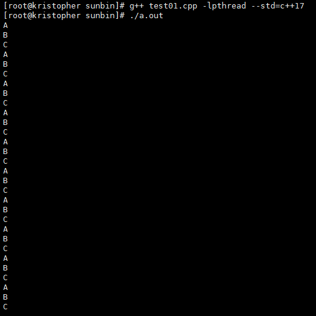

# 多线程轮流打印ABC
1. 例子

```bash
#include <iostream>
#include <thread>
#include <condition_variable>
#include <vector>
#include <algorithm>
#include <functional>
#include <thread>
#include <mutex>

std::mutex mtx;
std::condition_variable variable;
char g_ch = 0;

void print_fun(char ch)
{
    int cyle_cnt = 10;
    char ch_ = ch - 'A';

    for (int i = 0; i < cyle_cnt; i++)
    {
        std::unique_lock<std::mutex> ulk(mtx);
        variable.wait(ulk, [ch_] { return ch_ == g_ch; });
        std::cout << (char)(ch_ + 'A') << std::endl;
        g_ch = (ch_ + 1) % 3;
        ulk.unlock();

        variable.notify_all();
    }
}

int main()
{
    std::vector<std::thread> threads;
    threads.push_back(std::thread(print_fun, 'A'));
    threads.push_back(std::thread(print_fun, 'B'));
    threads.push_back(std::thread(print_fun, 'C'));

    std::for_each(threads.begin(), threads.end(), std::mem_fn(&std::thread::join));

    std::cout << std::endl;
    return 0;
}
```
输出：

