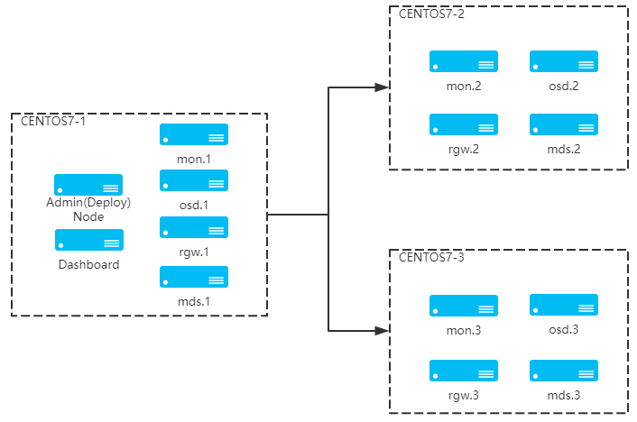

##  一、 基础配置

集群拓扑图：



三台环境为centos7，以下配置需要在每台机器上执行：

| 名称   | 主机IP         | 说明                    |
| ------ | -------------- | -----------------------|
| node01 | 192.168.19.101 | mon、mds、rgw、mgr、osd |
| node02 | 192.168.19.102 | mon、mds、rgw、mgr、osd |
| node03 | 192.168.19.103 | mon、mds、rgw、mgr、osd |

1. 配置host 解析：
```bash
cat >> /etc/hosts <<EOF
192.168.19.101 node1
192.168.19.102 node2
192.168.19.103 node3
EOF
```

2. 关闭防火墙和`selinux`：

```bash
systemctl stop firewalld && systemctl disable firewalld
setenforce 0 && sed -i 's/SELINUX=enforcing/SELINUX=disabled/g' /etc/selinux/config
```

3. 分别在三个节点设置主机名：

```bash
hostnamectl set-hostname node1
hostnamectl set-hostname node2
hostnamectl set-hostname node3
```

4. 配置主机时间同步:

```bash
systemctl restart chronyd.service && systemctl enable chronyd.service
```

5. 设置`/etc/ceph/ceph.conf`配置项：

```bash
auth client required = cephx
auth cluster required = cephx
auth service required = cephx
```

##  二、mon部署 

1. 为集群生成唯一的`fsid`：

```
uuidgen
```

2. 为此集群创建密钥环 `keyring` 并生成监视器密钥 ：

```bash
sudo ceph-authtool --create-keyring /tmp/ceph.mon.keyring --gen-key -n mon. --cap mon 'allow *'
```

输出：

```bash
[root@node01 ~]# cat /tmp/ceph.mon.keyring
[mon.]
	key = AQBQYt9kQr8SDBAA05KJPJ7wj/cojuhu6rvVWQ==
	caps mon = "allow *"
```

生成管理员密钥环 keyring，生成` client.admin `用户并加入密钥环：

```bash
sudo ceph-authtool --create-keyring /etc/ceph/ceph.client.admin.keyring --gen-key -n client.admin --cap mon 'allow *' --cap osd 'allow *' --cap mds 'allow *' --cap mgr 'allow *'
```

输出：

```bash
[root@node01 ~]# cat /etc/ceph/ceph.client.admin.keyring
[client.admin]
	key = AQB3Yt9kcV0CHxAA2ljATohTAe0u75zEtyTgLA==
	caps mds = "allow *"
	caps mgr = "allow *"
	caps mon = "allow *"
	caps osd = "allow *"
```

4. 生成管理员密钥环 `keyring`，生成 `client.admin` 用户并加入密钥环：

```bash
sudo ceph-authtool --create-keyring /etc/ceph/ceph.client.admin.keyring --gen-key -n client.admin --cap mon 'allow *' --cap osd 'allow *' --cap mds 'allow *' --cap mgr 'allow *'
```

输出：

```bash
[root@node01 ~]# cat /var/lib/ceph/bootstrap-osd/ceph.keyring
[client.bootstrap-osd]
	key = AQCmYt9kmTFMBBAAW8+Rwnv3iuRU6f2qVo5kXw==
	caps mgr = "allow r"
	caps mon = "profile bootstrap-osd"
```

5. 将生成的`keyring `导入到` ceph.mon.keyrin`：

```bash
sudo ceph-authtool /tmp/ceph.mon.keyring --import-keyring /etc/ceph/ceph.client.admin.keyring
sudo ceph-authtool /tmp/ceph.mon.keyring --import-keyring /var/lib/ceph/bootstrap-osd/ceph.keyring
```

输出：

```b ash
[root@node01 ~]# sudo ceph-authtool /tmp/ceph.mon.keyring --import-keyring /etc/ceph/ceph.client.admin.keyring
importing contents of /etc/ceph/ceph.client.admin.keyring into /tmp/ceph.mon.keyring
[root@node01 ~]# cat /tmp/ceph.mon.keyring
[mon.]
	key = AQBQYt9kQr8SDBAA05KJPJ7wj/cojuhu6rvVWQ==
	caps mon = "allow *"
[client.admin]
	key = AQB3Yt9kcV0CHxAA2ljATohTAe0u75zEtyTgLA==
	caps mds = "allow *"
	caps mgr = "allow *"
	caps mon = "allow *"
	caps osd = "allow *"

[root@node01 ~]# sudo ceph-authtool /tmp/ceph.mon.keyring --import-keyring /var/lib/ceph/bootstrap-osd/ceph.keyring
importing contents of /var/lib/ceph/bootstrap-osd/ceph.keyring into /tmp/ceph.mon.keyring
[root@node01 ~]# cat /tmp/ceph.mon.keyring
[mon.]
	key = AQBQYt9kQr8SDBAA05KJPJ7wj/cojuhu6rvVWQ==
	caps mon = "allow *"
[client.admin]
	key = AQB3Yt9kcV0CHxAA2ljATohTAe0u75zEtyTgLA==
	caps mds = "allow *"
	caps mgr = "allow *"
	caps mon = "allow *"
	caps osd = "allow *"
[client.bootstrap-osd]
	key = AQCmYt9kmTFMBBAAW8+Rwnv3iuRU6f2qVo5kXw==
	caps mgr = "allow r"
	caps mon = "profile bootstrap-osd"
```

6. 更改 `ceph.mon.keyring` 的所有者：

```bash
sudo chown ceph:ceph /tmp/ceph.mon.keyring
```

7. 使用主机名、主机 `IP` 地址和`fsid` 生成`monitor`映射，保存在 文件` /tmp/monmap`中：

``` bash
monmaptool --create --addv node01 [v2:192.168.19.101:3300,v1:192.168.19.101:6789]  --fsid 33af1a28-8923-4d40-af06-90c376ed74b0  /tmp/monmap
```

8. 在`monitor`主机上创建默认数据目录，目录名是`{cluster-name}-{hostname}`格式 :

```bash
sudo -u ceph mkdir /var/lib/ceph/mon/ceph-node01
```

9. 在`node1`节点对`monitor`进行初始化:

```bash
sudo -u ceph ceph-mon --mkfs -i node01  --monmap /tmp/monmap --keyring /tmp/ceph.mon.keyring
```

10. 将配置文件拷贝到其他节点：

```bash
scp /etc/ceph/ceph.conf node2:/etc/ceph/ceph.conf
scp /etc/ceph/ceph.conf node3:/etc/ceph/ceph.conf
```

11. 将`mon keyring,mon` `map`及`admin keyring`拷贝到其他节点

```bash
scp /tmp/ceph.mon.keyring node2:/tmp/ceph.mon.keyring
scp /etc/ceph/ceph.client.admin.keyring node2:/etc/ceph/ceph.client.admin.keyring
scp /tmp/monmap node2:/tmp/monmap

scp /tmp/ceph.mon.keyring node3:/tmp/ceph.mon.keyring
scp /etc/ceph/ceph.client.admin.keyring node3:/etc/ceph/ceph.client.admin.keyring
scp /tmp/monmap node3:/tmp/monmap
```

12. 在`node2`、`node3上`添加`monitor`，分别在这两个节点创建数据目录：

```bash
sudo -u mkdir /var/lib/ceph/mon/ceph-`hostname -s`
```

即：

```b ash
sudo -u mkdir /var/lib/ceph/mon/ceph-node02
sudo -u mkdir /var/lib/ceph/mon/ceph-node03
```

13. 分别在这两个节点对`monitor`进行初始化：

```bash
sudo -u ceph-mon --mkfs -i `hostname -s` --monmap /tmp/monmap --keyring /tmp/ceph.mon.keyring
```

即：

```bash
sudo -u ceph-mon --mkfs -i node02 --monmap /tmp/monmap --keyring /tmp/ceph.mon.keyring
sudo -u ceph-mon --mkfs -i node03 --monmap /tmp/monmap --keyring /tmp/ceph.mon.keyring
```

14. 分别在三个节点启动`ceph-mon`服务：

```bash
systemctl start ceph-mon@`hostname -s`
systemctl enable ceph-mon@`hostname -s`
```


##  三、 部署OSD

部署`osd`：
```bash
ceph-volume lvm create --bluestore --data /dev/sdx --block.wal /dev/nsdy --block.db /dev/sdz
ceph-volume	lvm create --bluestore --data /dev/sdx --block.db /dev/sdy
ceph-volume	lvm create --bluestore --data /dev/sdx
```
输出：
```bash
 [root@node01 mds]# ceph-volume  lvm create --bluestore --data /dev/sdd
Running command: /usr/bin/ceph-authtool --gen-print-key
Running command: /usr/bin/ceph --cluster ceph --name client.bootstrap-osd --keyring /var/lib/ceph/bootstrap-osd/ceph.keyring -i - osd new 411a36a0-15c1-4c62-b329-144c3af709f9
Running command: /usr/sbin/vgcreate --force --yes ceph-8ac53778-44de-4dba-9240-7cabd1e9ea44 /dev/sdd
 stdout: Physical volume "/dev/sdd" successfully created.
 stdout: Volume group "ceph-8ac53778-44de-4dba-9240-7cabd1e9ea44" successfully created
Running command: /usr/sbin/lvcreate --yes -l 5119 -n osd-block-411a36a0-15c1-4c62-b329-144c3af709f9 ceph-8ac53778-44de-4dba-9240-7cabd1e9ea44
 stdout: Logical volume "osd-block-411a36a0-15c1-4c62-b329-144c3af709f9" created.
Running command: /usr/bin/ceph-authtool --gen-print-key
Running command: /usr/bin/mount -t tmpfs tmpfs /var/lib/ceph/osd/ceph-2
Running command: /usr/sbin/restorecon /var/lib/ceph/osd/ceph-2
Running command: /usr/bin/chown -h ceph:ceph /dev/ceph-8ac53778-44de-4dba-9240-7cabd1e9ea44/osd-block-411a36a0-15c1-4c62-b329-144c3af709f9
Running command: /usr/bin/chown -R ceph:ceph /dev/dm-5
Running command: /usr/bin/ln -s /dev/ceph-8ac53778-44de-4dba-9240-7cabd1e9ea44/osd-block-411a36a0-15c1-4c62-b329-144c3af709f9 /var/lib/ceph/osd/ceph-2/block
Running command: /usr/bin/ceph --cluster ceph --name client.bootstrap-osd --keyring /var/lib/ceph/bootstrap-osd/ceph.keyring mon getmap -o /var/lib/ceph/osd/ceph-2/activate.monmap
 stderr: 2023-08-18 20:42:16.224 7f17f5c36700 -1 auth: unable to find a keyring on /etc/ceph/ceph.client.bootstrap-osd.keyring,/etc/ceph/ceph.keyring,/etc/ceph/keyring,/etc/ceph/keyring.bin,: (2) No such file or directory
2023-08-18 20:42:16.224 7f17f5c36700 -1 AuthRegistry(0x7f17f0065508) no keyring found at /etc/ceph/ceph.client.bootstrap-osd.keyring,/etc/ceph/ceph.keyring,/etc/ceph/keyring,/etc/ceph/keyring.bin,, disabling cephx
 stderr: got monmap epoch 1
Running command: /usr/bin/ceph-authtool /var/lib/ceph/osd/ceph-2/keyring --create-keyring --name osd.2 --add-key AQAnZ99kM378IBAAmqyuZMYDv6JwMKIguWypmA==
 stdout: creating /var/lib/ceph/osd/ceph-2/keyring
added entity osd.2 auth(key=AQAnZ99kM378IBAAmqyuZMYDv6JwMKIguWypmA==)
Running command: /usr/bin/chown -R ceph:ceph /var/lib/ceph/osd/ceph-2/keyring
Running command: /usr/bin/chown -R ceph:ceph /var/lib/ceph/osd/ceph-2/
Running command: /usr/bin/ceph-osd --cluster ceph --osd-objectstore bluestore --mkfs -i 2 --monmap /var/lib/ceph/osd/ceph-2/activate.monmap --keyfile - --osd-data /var/lib/ceph/osd/ceph-2/ --osd-uuid 411a36a0-15c1-4c62-b329-144c3af709f9 --setuser ceph --setgroup ceph
 stderr: 2023-08-18 20:42:16.569 7fe7d5ad9a80 -1 bluestore(/var/lib/ceph/osd/ceph-2/) _read_fsid unparsable uuid
--> ceph-volume lvm prepare successful for: /dev/sdd
Running command: /usr/bin/chown -R ceph:ceph /var/lib/ceph/osd/ceph-2
Running command: /usr/bin/ceph-bluestore-tool --cluster=ceph prime-osd-dir --dev /dev/ceph-8ac53778-44de-4dba-9240-7cabd1e9ea44/osd-block-411a36a0-15c1-4c62-b329-144c3af709f9 --path /var/lib/ceph/osd/ceph-2 --no-mon-config
Running command: /usr/bin/ln -snf /dev/ceph-8ac53778-44de-4dba-9240-7cabd1e9ea44/osd-block-411a36a0-15c1-4c62-b329-144c3af709f9 /var/lib/ceph/osd/ceph-2/block
Running command: /usr/bin/chown -h ceph:ceph /var/lib/ceph/osd/ceph-2/block
Running command: /usr/bin/chown -R ceph:ceph /dev/dm-5
Running command: /usr/bin/chown -R ceph:ceph /var/lib/ceph/osd/ceph-2
Running command: /usr/bin/systemctl enable ceph-volume@lvm-2-411a36a0-15c1-4c62-b329-144c3af709f9
 stderr: Created symlink from /etc/systemd/system/multi-user.target.wants/ceph-volume@lvm-2-411a36a0-15c1-4c62-b329-144c3af709f9.service to /usr/lib/systemd/system/ceph-volume@.service.
Running command: /usr/bin/systemctl enable --runtime ceph-osd@2
 stderr: Created symlink from /run/systemd/system/ceph-osd.target.wants/ceph-osd@2.service to /usr/lib/systemd/system/ceph-osd@.service.
Running command: /usr/bin/systemctl start ceph-osd@2
--> ceph-volume lvm activate successful for osd ID: 2
--> ceph-volume lvm create successful for: /dev/sdd
```
注意：部署OSD需要文件`/var/lib/ceph/bootstrap-osd/ceph.keyring`,  将node01的该文件拷贝到node02、node03，在node02、node03执行命令如下：
```bash
scp root@192.168.19.101:/var/lib/ceph/bootstrap-osd/ceph.keyring /var/lib/ceph/bootstrap-osd/
```
清除lvm格式的osd:
```bash
// 逻辑卷
ceph-volume lvm zap {vg name/lv name}
// 块设备
ceph-volume lvm zap /dev/sdc1
```
重建：
```bash
ceph-volume lvm zap /dev/sdc --destroy
```
逻辑卷无法删除:
```bash
dmsetup remove {lv name}
```

##  四、部署mgr
1. mgr节点执行：
```bash
sudo -u ceph mkdir /var/lib/ceph/mgr/ceph-`hostname -s`
```
2. 创建身份验证密钥:
```bash
ceph auth get-or-create mgr.`hostname -s`  mon 'allow profile mgr' osd 'allow *' mds 'allow *' > /var/lib/ceph/mgr/ceph-`hostname -s`/keyring
```
输出：
```bash
[root@node01 ~]# ceph auth get-or-create mgr.`hostname -s`  mon 'allow profile mgr' osd 'allow *' mds 'allow *' > /var/lib/ceph/mgr/ceph-`hostname -s`/keyring
[root@node01 ~]# cat /var/lib/ceph/mgr/ceph-`hostname -s`/keyring
[mgr.node01]
	key = AQCdZd9kPTGvFBAAArWhRWZqpNgVKgkQoYjtcA==
```
3. 启动mgr：
```bash
systemctl start ceph-mgr@node01
systemctl enable ceph-mgr@node01
```


## 五、部署mds
1. 创建`mds`数据目录:
```bash
sudo -u ceph mkdir -p /var/lib/ceph/mds/ceph-`hostname -s`
```
2. 创建keyting
```bash
ceph-authtool --create-keyring /var/lib/ceph/mds/ceph-`hostname -s`/keyring --gen-key -n mds.`hostname -s`
```
输出：
```bash
[root@node01 ~]# ceph-authtool --create-keyring /var/lib/ceph/mds/ceph-`hostname -s`/keyring --gen-key -n mds.`hostname -s`
creating /var/lib/ceph/mds/ceph-node01/keyring
[root@node01 ~]# cat /var/lib/ceph/mds/ceph-node01/keyring
[mds.node01]
	key = AQCTZt9kycWODhAA/0jjsASGYrQgnFmq36+qbQ==
```
3. 导入`keyring`并设置权限：
```bash
ceph auth add mds.`hostname -s` osd "allow rwx" mds "allow" mon "allow profile mds" -i /var/lib/ceph/mds/ceph-`hosname -s`/keyring
```
```bash
chown ceph:ceph /var/lib/ceph/mds/ceph-node01/keyring
```
启动`mds`：
```bash
systemctl start ceph-mds@`hostname -s` && systemctl enable ceph-mds@`hostname -s`
```
4. `cephfs` 需要两个`pool`池，`cephfs_data `和 `cephfs_metadata`，分别存储文件数据和文件元数据

创造数据 pool
```bash
ceph osd pool create cephfs_data 4
```
创造元数据pool
```bash
ceph osd pool create cephfs_metadata 4
```
启动文件系统：元数据池在前，数据池在后
```bash
ceph fs new cephfs cephfs_metadata cephfs_data
```


## 六、部署rgw
1. 创建`keyring`：
```bash
ceph-authtool --create-keyring /etc/ceph/ceph.client.radosgw.keyring
chown ceph:ceph /etc/ceph/ceph.client.radosgw.keyring
```
输出：
```bash
[root@node01 ~]# ceph-authtool --create-keyring /etc/ceph/ceph.client.radosgw.keyring
creating /etc/ceph/ceph.client.radosgw.keyring
[root@node01 ~]# cat /etc/ceph/ceph.client.radosgw.keyring
[root@node01 ~]#
```
2. 生成`ceph-radosgw`服务对应的用户和key：
```bash
ceph-authtool /etc/ceph/ceph.client.radosgw.keyring -n client.rgw.node01 --gen-key
```
输出：
```bash
[root@node01 ~]# ceph-authtool /etc/ceph/ceph.client.radosgw.keyring -n client.rgw.node01 --gen-key
[root@node01 ~]# cat /etc/ceph/ceph.client.radosgw.keyring
[client.rgw.node01]
	key = AQA+aN9kW/wEHBAAWu1bMUojV9Ala6Hd+LYdEw==
```
3. 添加用户访问权限：
```bash
ceph-authtool -n client.rgw.node01 --cap osd 'allow rwx' --cap mon 'allow rwx' /etc/ceph/ceph.client.radosgw.keyring
```
输出：
```bash
[root@node01 ~]# ceph-authtool -n client.rgw.node01 --cap osd 'allow rwx' --cap mon 'allow rwx' /etc/ceph/ceph.client.radosgw.keyring
[root@node01 ~]# cat /etc/ceph/ceph.client.radosgw.keyring
[client.rgw.node01]
	key = AQA+aN9kW/wEHBAAWu1bMUojV9Ala6Hd+LYdEw==
	caps mon = "allow rwx"
	caps osd = "allow rwx
```
4. 将`keyring`导入集群中：
```bash
ceph -k /etc/ceph/ceph.client.admin.keyring auth add client.rgw.node01 -i /etc/ceph/ceph.client.radosgw.keyring
```
5. 编辑配置文件：
```bash
[client.rgw.node01]
host = node01
keyring = /etc/ceph/ceph.client.radosgw.keyring #重点
log file = /var/log/ceph/ceph-rgw-node01.log
rgw frontends = civetweb  port=8080 num_threads=10000
rgw thread pool size = 512
rgw_s3_auth_use_rados = true
rgw_s3_auth_use_keystone = false
rgw_s3_auth_aws4_force_boto2_compat = false
rgw_s3_auth_use_ldap = false
rgw_s3_success_create_obj_status = 0
rgw_relaxed_s3_bucket_names = false
```
6. 启动`rgw`服务：
```bash
systemctl start ceph-radosgw@rgw.node01 && systemctl enable ceph-radosgw@rgw.node01
```

