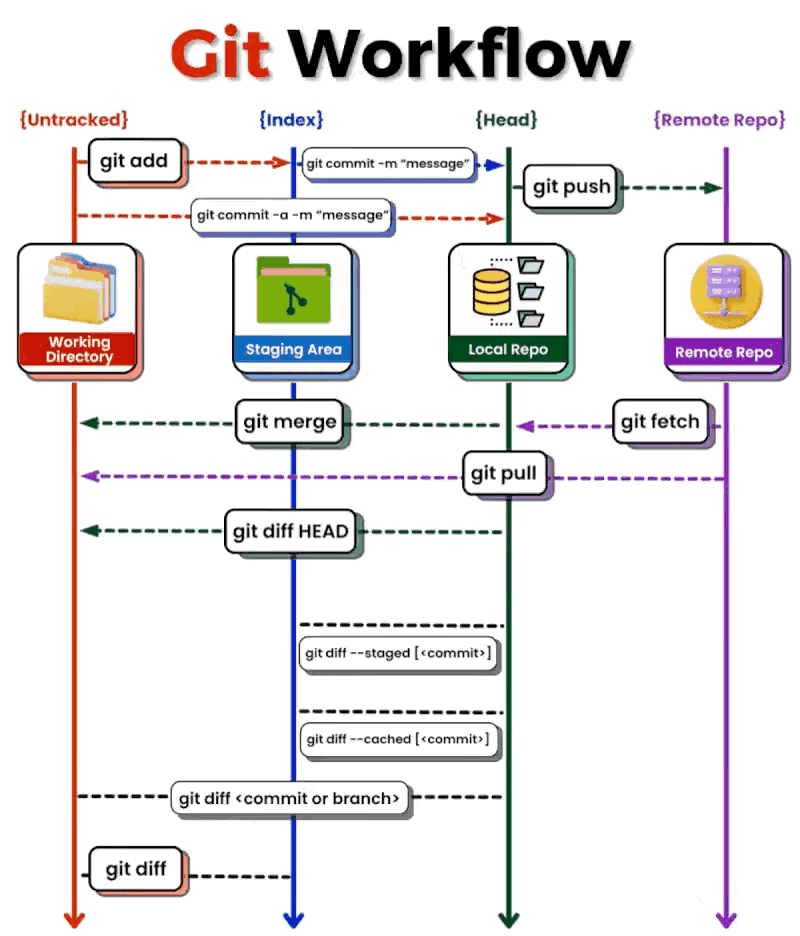

## 设置日志级别


查询配置命令：

```bash
ceph --admin-daemon  ./ceph-mon.node02.asok help
```
输出如下：
```bash
[root@node02 ~]# ceph --admin-daemon  ./ceph-mon.node02.asok  help
{
    "add_bootstrap_peer_hint": "add peer address as potential bootstrap peer for cluster bringup",
    "add_bootstrap_peer_hintv": "add peer address vector as potential bootstrap peer for cluster bringup",
    "config diff": "dump diff of current config and default config",
    "config diff get": "dump diff get <field>: dump diff of current and default config setting <field>",
    "config get": "config get <field>: get the config value",
    "config help": "get config setting schema and descriptions",
    "config set": "config set <field> <val> [<val> ...]: set a config variable",
    "config show": "dump current config settings",
    "config unset": "config unset <field>: unset a config variable",
    "dump_historic_ops": "show recent ops",
    "dump_historic_ops_by_duration": "show recent ops, sorted by duration",
    "dump_historic_slow_ops": "show recent slow ops",
    "dump_mempools": "get mempool stats",
    "get_command_descriptions": "list available commands",
    "git_version": "get git sha1",
    "help": "list available commands",
    "log dump": "dump recent log entries to log file",
    "log flush": "flush log entries to log file",
    "log reopen": "reopen log file",
    "mon_status": "show current monitor status",
    "ops": "show the ops currently in flight",
    "perf dump": "dump perfcounters value",
    "perf histogram dump": "dump perf histogram values",
    "perf histogram schema": "dump perf histogram schema",
    "perf reset": "perf reset <name>: perf reset all or one perfcounter name",
    "perf schema": "dump perfcounters schema",
    "quorum enter": "force monitor back into quorum",
    "quorum exit": "force monitor out of the quorum",
    "quorum_status": "show current quorum status",
    "sessions": "list existing sessions",
    "sync_force": "force sync of and clear monitor store",
    "version": "get ceph version"
}
```
rgw日志：
```bash
ceph --admin-daemon /var/run/ceph/ceph-client.rgw.<name>.asok config set debug_rgw 1\/5
ceph --admin-daemon /var/run/ceph/ceph-client.rgw.<name>.asok config set debug_ms 0\/5
```
<br>

列举配置项值：
```bash
ceph --admin-daemon ./ceph-mon.node02.asok config show
ceph --admin-daemon /var/run/ceph/ceph-mon.node02.asok config show
```
查询请求状态：
```bash
ceph --admin-daemon /var/run/ceph-mon.node02.asok dump_historic_ops
```
osd日志：

1. 正常：
```bash
ceph --admin-daemon /var/run/ceph/ceph-osd.24.asok config set dug_osd 1/5
```
2. 设置：
```bash
ceph --admin-daemon /var/run/ceph/ceph-osd.24.asok config set dug_osd 20/20
```
